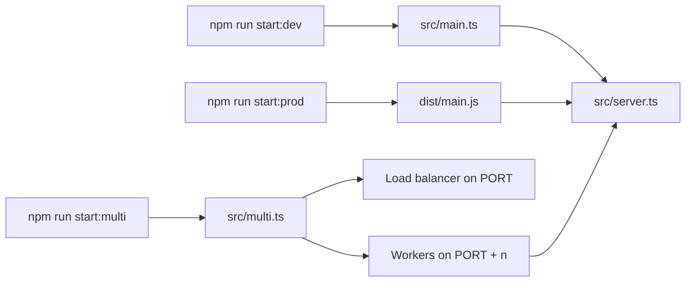

# CRUD API


A TypeScript CRUD API for a product catalog built with [Fastify](https://fastify.dev/), in-memory storage, and an optional clustered mode with round-robin load balancing.

Assignment reference: [CRUD API](https://github.com/AlreadyBored/nodejs-assignments/blob/main/assignments-v2/03-crud-api/assignment.md)

## Table of Contents

- [Overview](#overview)
- [Prerequisites](#prerequisites)
- [Setup](#setup)
- [Environment Configuration](#environment-configuration)
- [Available Scripts](#available-scripts)
- [Run Modes](#run-modes)
- [Usage](#usage)
- [Libraries Used](#libraries-used)
- [Project Structure](#project-structure)

## Overview

This repository provides:

- CRUD endpoints for `/api/products`
- request validation and human-friendly HTTP error responses
- development, production, and clustered startup modes
- TypeScript path aliases via `@/`
- linting, formatting, type-checking, and integration tests

Key code entrypoints:

- [`src/main.ts`](./src/main.ts) starts the single-process application
- [`src/multi.ts`](./src/multi.ts) starts the clustered mode with a load balancer
- [`src/server.ts`](./src/server.ts) assembles the Fastify server and routes
- [`package.json`](./package.json) defines the full script surface

## Prerequisites

> [!IMPORTANT]
> This project requires **Node.js 24.10.0 or later** and an npm version bundled with that Node.js release.

## Setup

### 1. Clone the repository

```bash
git clone https://github.com/Mxmmsv/CRUD-API mxmmsv-CRUD-API
```

### 2. Enter the project directory

```bash
cd mxmmsv-CRUD-API
```

### 3. Install dependencies

```bash
npm install
```

### 4. Create a local `.env` file from the example

```bash
cp .env.example .env
```

### 5. Switch to the `develop` branch

```bash
git switch develop
```

## Environment Configuration

The committed example file is [`.env.example`](./.env.example), and the current user-facing variable is:

```env
PORT=4000
```

> [!IMPORTANT]
> [`src/env.d.ts`](./src/env.d.ts) contains TypeScript typings for environment variables used by the application **and by its scripts/runtime internals**, not only for values the user is expected to put into `.env`.

Only `PORT` belongs in the user-managed `.env` file.

Internal variables also declared in [`src/env.d.ts`](./src/env.d.ts):

- `WORKER_PORT` is assigned internally when clustered workers are spawned[^worker-port]
- `EXPOSE_WORKER_PORT` is used only for automated multi-process diagnostics/tests[^expose-worker-port]

> [!CAUTION]
> Do **not** add `WORKER_PORT` or `EXPOSE_WORKER_PORT` to `.env`. They are runtime-managed values rather than user configuration.

## Available Scripts

All scripts are defined in [`package.json`](./package.json).

### Start the app in development mode

Watches the `src` directory with `nodemon` and starts the app through [`src/main.ts`](./src/main.ts) using `tsx`.

```bash
npm run start:dev
```

### Start the app in production mode

Builds the project and then runs the bundled single-process entrypoint from `dist/main.js`.

```bash
npm run start:prod
```

### Start the app in clustered mode

Builds the project and starts [`src/multi.ts`](./src/multi.ts), which launches a load balancer on `PORT` and worker processes on `PORT + n`.

```bash
npm run start:multi
```

### Build the project

Compiles TypeScript and rewrites path aliases for the generated ESM output.

```bash
npm run build
```

### Run the TypeScript type-checker

Runs `tsc --noEmit` without writing build output.

```bash
npm run check
```

### Run the test suite

Runs the integration tests with Node's built-in test runner and `tsx`.

```bash
npm test
```

### Run the linter

Checks the repository with ESLint using the flat config in [`eslint.config.js`](./eslint.config.js).

```bash
npm run lint
```

### Run the linter with auto-fixes

Applies safe ESLint fixes where possible.

```bash
npm run lint:fix
```

### Format the repository

Formats files with Prettier.

```bash
npm run format
```

### Check formatting without rewriting files

Verifies whether the repository already matches the Prettier style.

```bash
npm run format:check
```

## Run Modes

The project exposes three primary startup flows:



### Single-process development

- Entry file: [`src/main.ts`](./src/main.ts)
- Reads `PORT` through [`src/config/env.ts`](./src/config/env.ts)
- Builds the Fastify app through [`src/server.ts`](./src/server.ts)

### Single-process production

- Uses the same application path as development
- Runs compiled output from `dist/`
- Keeps path aliases working through `tsc-alias`

### Clustered mode with round-robin load balancing

- Entry file: [`src/multi.ts`](./src/multi.ts)
- Keeps the load balancer on `PORT`
- Starts workers on `PORT + n`
- Uses `availableParallelism() - 1` worker processes
- Shares application state across workers through the primary process and IPC

## Usage

> [!TIP]
> The examples below assume the application is already running on `http://localhost:4000`.

Base API path:

```text
http://localhost:4000/api/products
```

### Get all products

```bash
curl http://localhost:4000/api/products
```

### Create a product

```bash
curl -X POST http://localhost:4000/api/products \
  -H "Content-Type: application/json" \
  -d '{
    "name": "Mechanical Keyboard",
    "description": "Hot-swappable 75% keyboard",
    "price": 149.99,
    "category": "electronics",
    "inStock": true
  }'
```

### Get a product by id

```bash
curl http://localhost:4000/api/products/<productId>
```

### Update a product

```bash
curl -X PUT http://localhost:4000/api/products/<productId> \
  -H "Content-Type: application/json" \
  -d '{
    "name": "Mechanical Keyboard Pro",
    "description": "Hot-swappable 75% keyboard with aluminum case",
    "price": 179.99,
    "category": "electronics",
    "inStock": false
  }'
```

### Delete a product

```bash
curl -X DELETE http://localhost:4000/api/products/<productId>
```

### Common response behavior

- `GET /api/products` returns `200` and an array of products
- `POST /api/products` returns `201` and the created product
- `PUT /api/products/:id` returns `200` and the updated product
- `DELETE /api/products/:id` returns `204` with an empty response body
- invalid UUIDs return `400`
- missing records return `404`
- invalid request bodies return `400`

## Libraries Used

### Runtime dependencies

- [`fastify`](https://www.npmjs.com/package/fastify): HTTP framework used to define routes, validation behavior, and error handling
- [`dotenv`](https://www.npmjs.com/package/dotenv): loads local environment variables from `.env`
- [`uuid`](https://www.npmjs.com/package/uuid): validates incoming product IDs as UUIDs

### Development and tooling dependencies

- [`typescript`](https://www.npmjs.com/package/typescript): TypeScript compiler and type system
- [`tsx`](https://www.npmjs.com/package/tsx): runs TypeScript entrypoints directly in development and tests
- [`tsc-alias`](https://www.npmjs.com/package/tsc-alias): rewrites `@/` path aliases in compiled ESM output
- [`nodemon`](https://www.npmjs.com/package/nodemon): restarts the app automatically during local development
- [`eslint`](https://www.npmjs.com/package/eslint): core linter
- [`@eslint/js`](https://www.npmjs.com/package/@eslint/js): official base ESLint rule presets
- [`typescript-eslint`](https://www.npmjs.com/package/typescript-eslint): TypeScript-aware linting support
- [`eslint-plugin-n`](https://www.npmjs.com/package/eslint-plugin-n): Node.js-specific lint rules
- [`eslint-plugin-perfectionist`](https://www.npmjs.com/package/eslint-plugin-perfectionist): import and code ordering rules
- [`eslint-config-prettier`](https://www.npmjs.com/package/eslint-config-prettier): disables formatting rules that conflict with Prettier
- [`prettier`](https://www.npmjs.com/package/prettier): code formatter
- [`globals`](https://www.npmjs.com/package/globals): shared global variable definitions for lint config
- [`@types/node`](https://www.npmjs.com/package/@types/node): Node.js type declarations for TypeScript

## Project Structure

```text
src/
|-- main.ts
|-- multi.ts
|-- server.ts
|-- env.d.ts
|-- types.ts
|-- cluster/
|   |-- index.ts
|   |-- product-store-messages.ts
|   |-- round-robin.ts
|   `-- types.ts
|-- config/
|   `-- env.ts
`-- storage/
    |-- index.ts
    |-- product-store.ts
    `-- types.ts
```

Quick map of responsibilities:

- [`src/main.ts`](./src/main.ts): single-process startup
- [`src/multi.ts`](./src/multi.ts): clustered startup, worker orchestration, and load balancing
- [`src/server.ts`](./src/server.ts): Fastify app assembly and API routes
- [`src/env.d.ts`](./src/env.d.ts): TypeScript declarations for `process.env`
- [`src/storage/index.ts`](./src/storage/index.ts): storage entrypoint exports
- [`src/cluster/index.ts`](./src/cluster/index.ts): cluster helper and message exports

[^worker-port]: `WORKER_PORT` is injected by the clustered runtime so each worker listens on a distinct port.
[^expose-worker-port]: `EXPOSE_WORKER_PORT` is used by automated tests to expose the selected worker port through a diagnostic response header. It is not part of normal user configuration.
